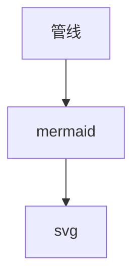

# M3 样例：Markdown 全要素

本文件是 M3 E2E（apps/web/e2e/m3.spec.ts）的断言素材：表格、任务列表、围栏
代码高亮、KaTeX 公式、灯箱图片、mermaid 图与 callout 卡片。目录侧栏（TOC）
的项数应等于本文件 h1-h4 标题数（9），点击目录项可滚动到对应标题。

## 表格

| 特性 | 状态 |
| ---- | ---- |
| GFM 表格 | 渲染正常 |
| 对齐样式 | 默认左对齐 |

## 任务列表

- [x] 已完成：五步管线（highlight → diagrams → katex → copyCode → lightbox）
- [ ] 待办：复选框为禁用态（taskLists enabled: false）

## 代码围栏

```ts
const answer: number = 42;
export function greet(who: string): string {
  return `hello ${who}`;
}
```

## 公式

行内公式 $E = mc^2$ 与块级公式：

$$
\int_0^1 x^2 \, dx = \frac{1}{3}
$$

## 灯箱图片

点击下方图片打开灯箱。图片用 data URI 内嵌：实测 markdown 相对路径
`` 净化后保留，但按应用 origin 解析为 404（store 无相对
路径解析），故样例采用 data URI。


## 流程图



> [!note] 提示
> 这是 callout 卡片：blockquote 首段以 `[!note]` 开头时转换为
> markdown-alert-note 卡片（标题 + 内容两段结构）。

### 小节甲

填充段落：目录点击滚动的落点应在此附近。滚动容器是 `.vv-viewer-scroll`，
内容超过视口高度才能产生滚动位移，以下段落仅用于撑高文档。

第一填充段：vviewer 是纯前端文件查看器，markdown 管线把不可信源码净化后
再增强展示。表格、任务列表来自 markdown-it 内建与插件，围栏高亮经
HighlightClient（tree-sitter 主路径，hljs 兜底）。

第二填充段：KaTeX 与 mermaid 均为动态 import，mermaid 在浏览器环境真实
渲染（jsdom 单测里 mock），失败时容器保留原文并加错误样式类。

第三填充段：灯箱 overlay 挂在 body（不随渲染节点销毁），渲染实例 destroy
时显式清理——切换 tab 后 overlay 必须消失。

第四填充段：目录侧栏由渲染实例 getToc() 上行，h1-h4 文档序；标题 id 由
slugifyHeading 生成（CJK 保留），点击项 scrollIntoView 平滑滚动。

第五填充段：文件内搜索（/ 唤起）对渲染视图走 DOM TreeWalker 包 mark，
退出搜索还原原文本节点，保证文本无损。

#### 小节乙

本文件共 9 个 h1-h4 标题：1 个 h1、6 个 h2、1 个 h3、1 个 h4。
